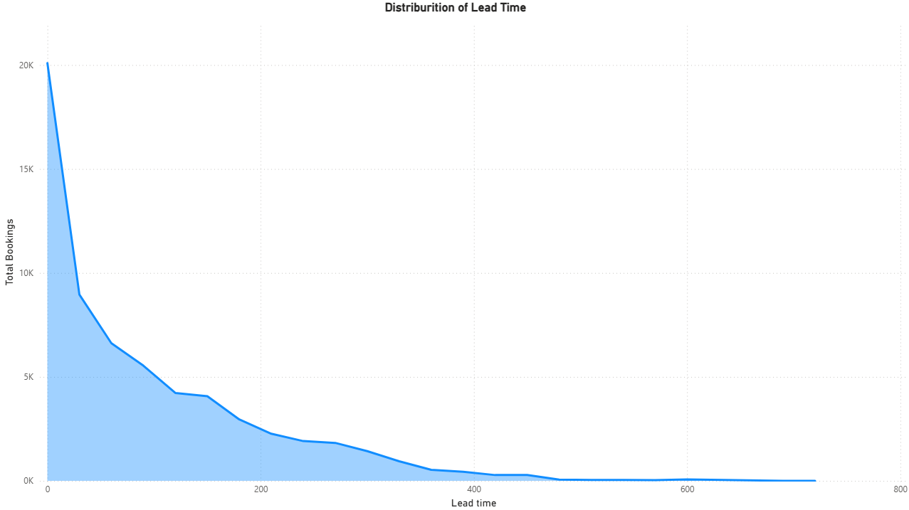
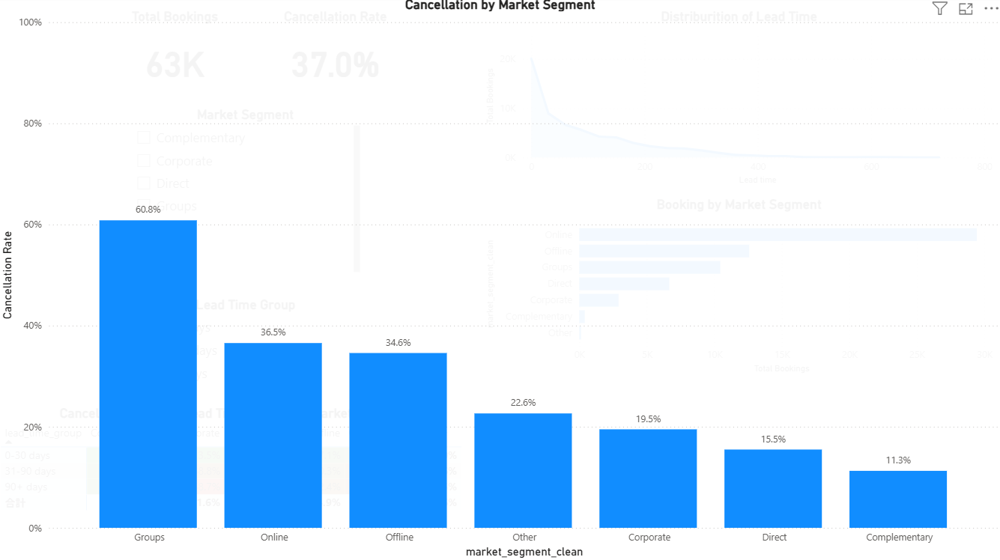

# 🏨 Hotel Booking Analysis Dashboard (Power BI)

## 📌 Overview
This project analyzes hotel booking and cancellation behavior to identify
patterns in lead time, market segments, and cancellation risk.
The analysis was conducted using BigQuery (SQL), Python, and Power BI.

---

## 🎯 Objectives
- Understand the distribution of booking lead time
- Analyze bookings and cancellation behavior by market segment
- Identify high-risk segments and booking conditions
- Provide actionable insights for pricing and reservation strategies

---

## 🗂 Dataset
- **Dataset**: Hotel Booking Demand Dataset  
- **Source**: Data in Brief (2019) / Kaggle  
- **Original Size**: ~119,000 records  

⚠️ Due to **BigQuery Free Tier limitations**,  
the Power BI dashboard uses **approximately 63,000 records (63K)**.

This sample size is sufficient to identify overall trends  
and demonstrate analytical and visualization techniques.

---

## 🧹 Data Cleaning Process
The following steps were applied to prepare the data:

1. Checked for missing values and invalid guest counts
2. Removed records with zero total guests
3. Combined split arrival date columns into a single date field
4. Cleaned and consolidated categorical variables:
   - Market Segment
   - Distribution Channel
   - Meal
5. Removed non-essential columns
6. Created an analysis-ready cleaned dataset

---

## 🛢 SQL Analysis (BigQuery)

SQL was used to prepare aggregated tables for dashboard analysis.

Created SQL scripts:
- bookings_by_market_segment.sql
- cancellation_rate_by_market_segment.sql
- cancellation_rate_by_lead_time_group.sql
- cancellation_rate_by_lead_time_group_and_market_segment.sql

These queries were designed to directly support Power BI visualizations
and reduce the need for complex DAX calculations.

---

## 📊 Python Visualization

The following Python scripts were created for exploratory data analysis and visualization:

- Distribution of Lead Time
- Bookings by Market Segment
- Cancellation Rate by Market Segment
- Cancellation Rate by Lead Time Group and Market Segment

---

## 📷 Dashboard Screenshot
### 1. Overall Dashboard

### 2. Distribution of Lead Time

### 3. Cancellation Rate by Market Segment

### 4. Lead Time Group × Market Segment × Cancellation Rate

---

## 📊 Dashboard Components

### KPI Cards
- **Total Bookings**
- **Cancellation Rate**

### Visualizations
- Distribution of Lead Time  
- Bookings by Market Segment  
- Cancellation Rate by Market Segment  
- Lead Time Group × Market Segment × Cancellation Rate (Matrix)

### Interactive Features
- Market Segment Slicer  
- Lead Time Group Slicer  

*Note: The dashboard is presented as static screenshots in this repository,  
but all visuals support interactive filtering in Power BI.*

---

## 🔍 Key Insights

### 1. Lead Time Patterns
- Most bookings are made with short lead times
- Longer lead times are associated with higher cancellation rates

### 2. Market Segment Analysis
- Online Travel Agents generate the highest number of bookings
- Group bookings show the highest cancellation rate

### 3. Combined Analysis (Lead Time × Market Segment)
- High cancellation risk is observed for  
  **long lead time bookings in Group and OTA segments**
- Early-bird incentives and stricter cancellation policies could help reduce risk

---

## 🛠 Tools & Technologies
- **Python** (Pandas, Matplotlib)
- **SQL / BigQuery**
- **Power BI**
- **GitHub**

---

## 📈 Key Learnings
- Implemented a full analytics workflow from raw data to insights
- Designed KPI-driven dashboards with slicers and matrix visuals in Power BI
- Translated analytical findings into business-oriented recommendations

---

## ✍ Author
Yoshihiro Tsunoda  
2025-12-23
